Setup
===
[OpenCV 4.1.1 Setup](setup.md)

Camera distortion calibration
===
### How to use
```shell
make calibration
./calibration -h (chessboard height) -w (chessboard width)
```
`-h` : chess board height
`-w` : chess board width
`-p` : chess boatd image folder path (default : ./calib)
`-o` : output ymal file path (default : ./cameraParameter.yml)

#### Example
```c++
Mat cameraMatrix, distCoeffs;
string cameraParameterPath = "./cameraParameter.yml";
FileStorage storage(cameraParameterPath, FileStorage::READ);
storage["camera matrix"] >> cameraMatrix;
storage["distortion coefficients"] >> distCoeffs;
storage.release();

Rect undistortRect;
Mat newCameraMat = getOptimalNewCameraMatrix(cameraMat, distCoeffs, Size(1280, 720), 1, Size(1280, 720), &undistortRect);
Mat undistortMap1, undistortMap2;
initUndistortRectifyMap(cameraMat, distCoeffs, Mat(), newCameraMat, Size(1280, 720), CV_32FC1, undistortMap1, undistortMap2);

// in roop
Mat undistort_src;
remap(src, undistort_src, undistortMap1, undistortMap2, INTER_LINEAR);
Mat roi_undistort_src;
roi_undistort_src = undistort_src(undistortRect & Rect(0, 0, src.cols, src.rows));
```
##### Before Calibration 
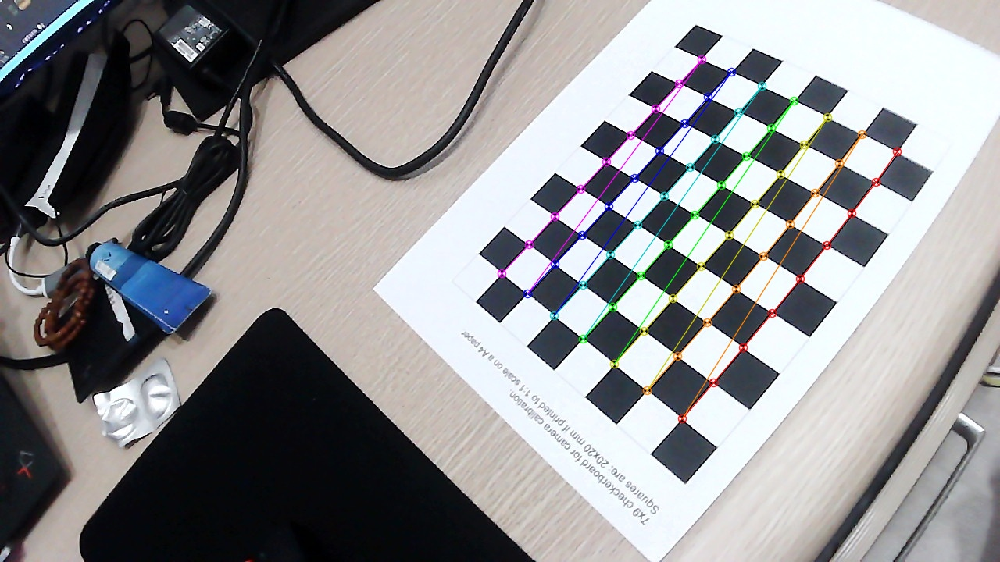
##### Undistort Image 
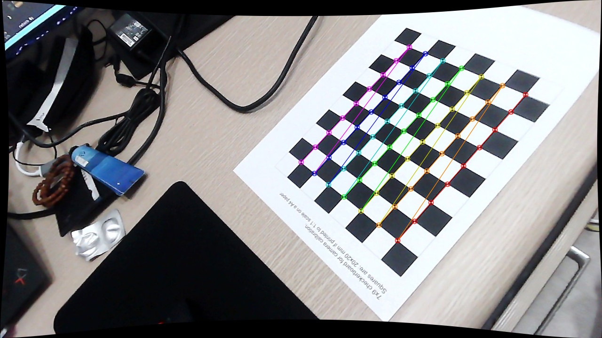
##### Undistort Image with roi
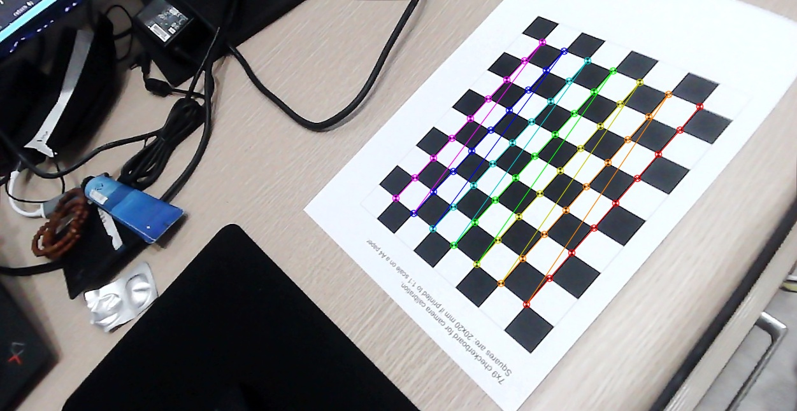

Lane detect
===
process of lane detect 
1. Image tranform to top view
1. Convert image to gray scale
1. Gaussian blurrring
1. Filtering
1. Polynomial fitting & Image inverse tranform to original view
#### Image transform to top view
before|after
:----:|:----:
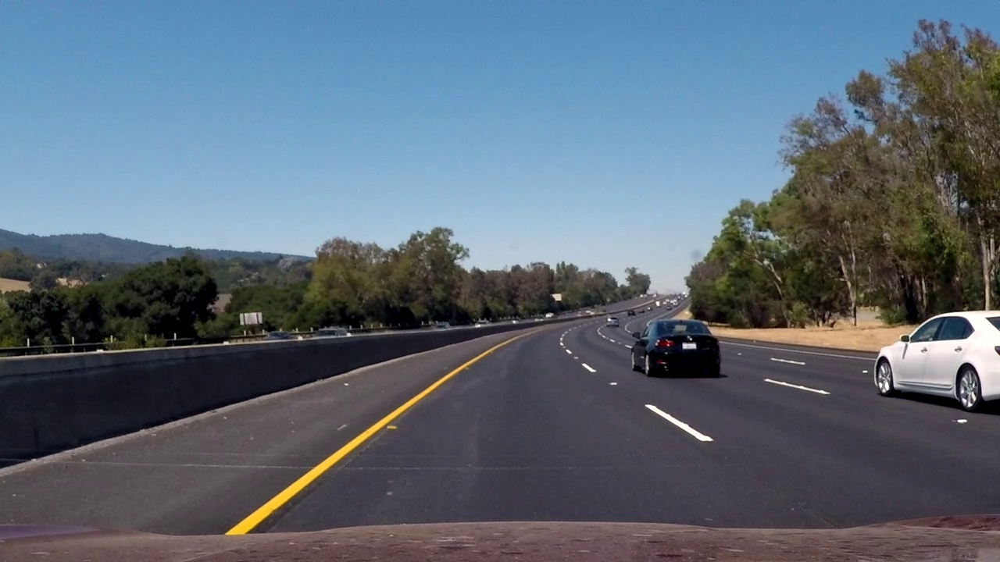 | 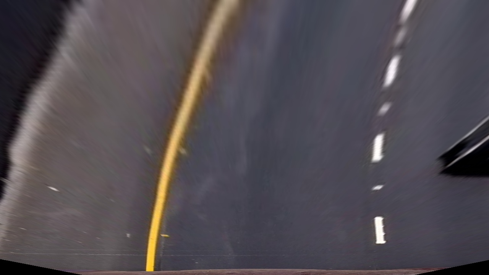
#### Convert image to gray scale & Blurring
grayscale | blurred
:----:|:----:
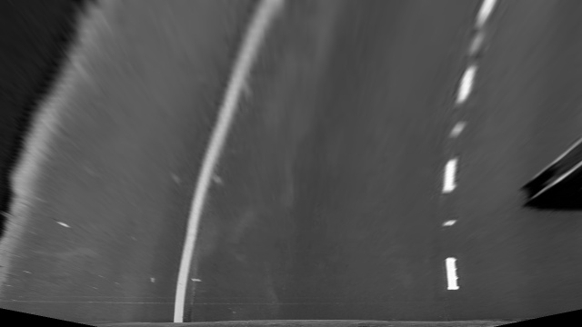 | 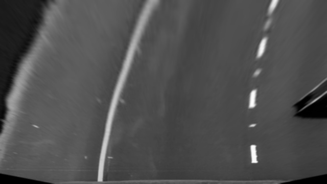
#### Filtering
##### Top Hat filtering
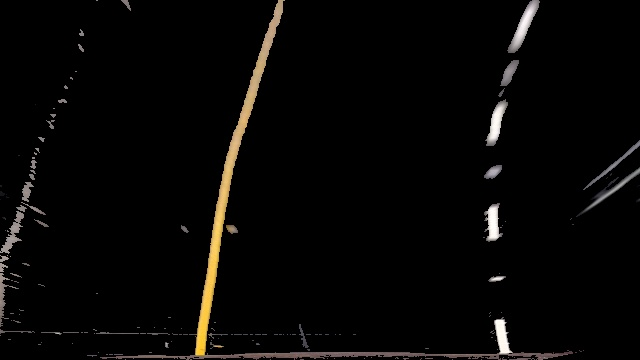

Sobel filtering|Color filtering
:----:|:----:
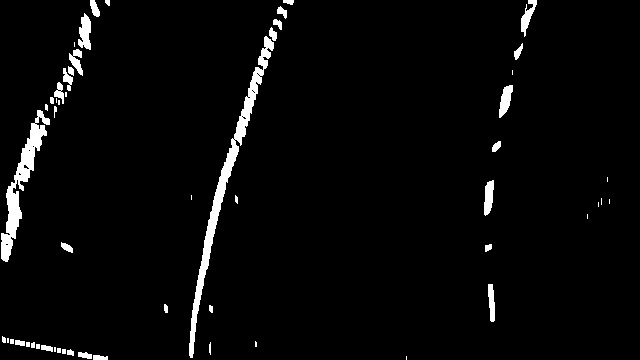 | 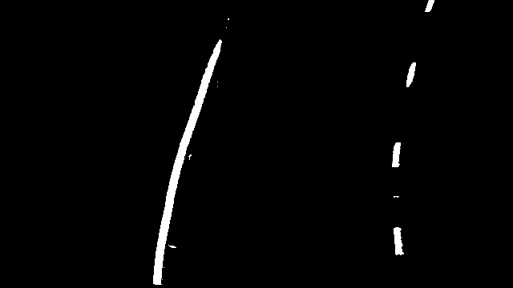
#### Find lane area from Sobel filter and Color filter
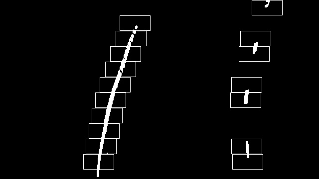
#### Polynomial fitting & Image inverse tranform to original view
before|after
:----:|:----:
 | 

Demo Video
===
[](https://youtu.be/207KhGTem64)