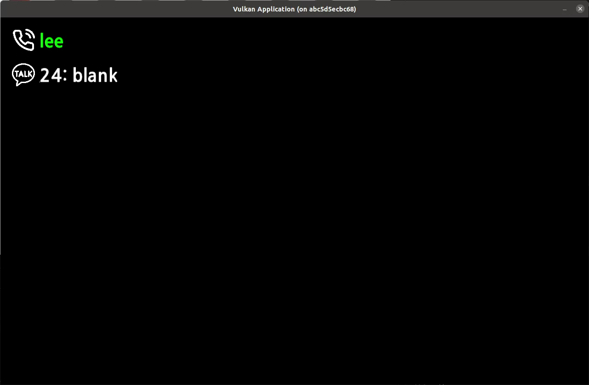
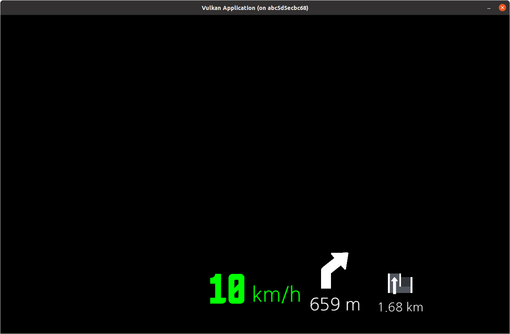
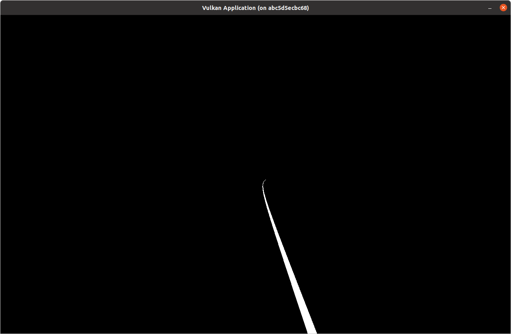
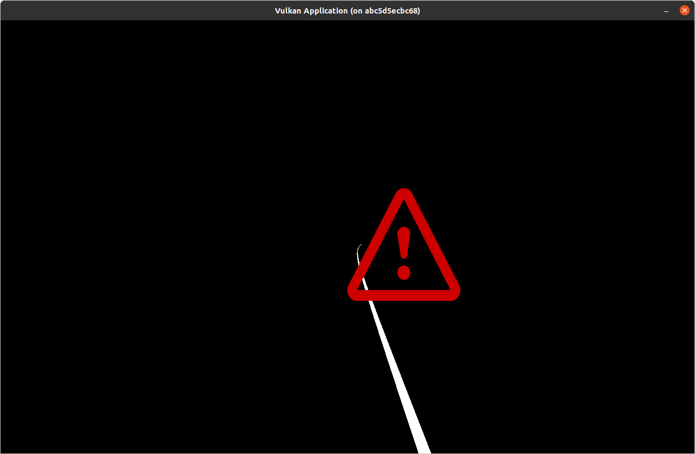

Setup
===
[Here](SETUP.md) 

Example
===
(Code) [Source](src/UserObject.cpp) [Header](include/vulkan/UserObject.h) 

### Notification


### Navigation


### Polyline


### Warning


How to use
===

### Simple Class Example
```c++
// MyObject.cpp
class MyObject : public UserObject
{
private:
    glm::vec3 position, width, normal;
    glm::vec4 color;

    Object *obj;
public:
    MyObject() {
        obj = new Object;
    }

    void create(std::string path) {
        obj->setPosition(position);
        obj->setWidth(width);
        obj->setNormal(normal);
        obj->setColor(color);
        obj->create(OBJECT_FLAG_USE_TEXTURE | OBJECT_FLAT_USE_3D, path);
    }
	void destroy() {
        obj->destroy();
    }

    void bindCommandBuffer(VkCommandBuffer commandBuffer, int index) {
        if(obj->getState() == OBJECT_STATE_RESERVE_DELETE){
            obj->setBindingFlag(index, false);
            return;
        }
        obj->setBindingFlag(index, true);
        vkCmdBindPipeline(commandBuffer, VK_PIPELINE_BIND_POINT_GRAPHICS, obj->getPipeline()->getPipeline());

        VkBuffer vertexBuffers[] = {obj->getVertexBuffer()};
        VkDeviceSize offsets[] = {0};
        vkCmdBindVertexBuffers(commandBuffer, 0, 1, vertexBuffers, offsets);
        vkCmdBindIndexBuffer(commandBuffer, obj->getIndexBuffer(), 0, VK_INDEX_TYPE_UINT16);
        vkCmdBindDescriptorSets(commandBuffer, VK_PIPELINE_BIND_POINT_GRAPHICS, obj->getPipeline()->getPipelineLayout(), 0, 1, &((obj->getDescriptor()->getDescriptorSets())[index]), 0, nullptr);
        vkCmdDrawIndexed(commandBuffer, obj->getIndicesSize(), 1, 0, 0, 0);
    }
	
    void setState(int state) { obj->setState(state); }
    inline int getState() const { return obj->getState(); }
    void applyState() { obj->applyState(); }

    void updateUniformBuffer(uint32_t currentImage) {
        glm::mat4 model, view, proj;		
        glm::mat4 r;
        glm::vec3 normal = obj->getNormal();
        if(normal.x == 0 && normal.y == 0) r = glm::mat4(1.0f);
        else {
            r = glm::rotate(glm::mat4(1.0f),
                            (float)-atan2(sqrtf(normal.x*normal.x+normal.y*normal.y), normal.z), 
                            glm::vec3({normal.y, -normal.x, 0})) *
                glm::rotate(glm::mat4(1.0f),
                            (float)atan2(normal.x, -normal.y), 
                            glm::vec3({0, 0, 1}));
        }

        model = glm::translate(glm::mat4(1.0f), obj->getPosition()) *					
                r *
                glm::translate(glm::mat4(1.0f), {-obj->getWidth().x/2, -obj->getWidth().y/2, 0}) *
                glm::scale(glm::mat4(1.0f), {obj->getWidth(), 1});

        view = glm::lookAt (Camera::getInstance().eye,
                            Camera::getInstance().eye + Camera::getInstance().eye2center,
                            Camera::getInstance().up);

        proj = glm::perspective(glm::radians(60.0f), 		            //fov-y
                                WINDOW_WIDTH / (float) WINDOW_HEIGHT,	//aspect 
                                0.001f,						            //z near
                                500.0f);					            //z far
        proj[1][1] *= -1;
        obj->updateUniformBuffer(currentImage, proj * view * model);
    }

    /**
     *      Custom Function
     **/
};

// VulkanApplication.cpp
void init() {
    /**
     * code
     **/

    MyObject *m_obj = new MyObject;
    m_obj->create("texture.jpg");
    objects.push_back(m_obj);
}
```

